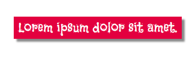

Tu peux utiliser la classe CSS `shadow` pour ajouter une ombre portée aux éléments HTML, tels que `<section>`, `
`, `` et `<blockquote>`.

Cet exemple ajoute une ombre à un élément `<blockquote>`.

## --- code ---

language: html
filename: index.html
line_numbers: false
--------------------------------------------------------

<main class="page">
  <section class="wrap">
    <blockquote class="secondary shadow">
Lorem ipsum dolor sit amet.
</blockquote>
  </section>
</main>

\--- /code ---

Tu peux ajuster les propriétés de la classe `shadow` dans `style.css` pour créer différentes ombres.

## --- code ---

language: css
filename: style.css
line_numbers: false
--------------------------------------------------------

.shadow {
box-shadow: 5px 5px 3px 0px #888888; /\* right and bottom shadow size, blur, spread, and colour \*/
/_box-shadow: 5px 5px 4px 2px var(--detail);_/
}

\--- /code ---

**Tip:** Try to add colour to your shadows. Use your detail colours `var(--detail)` or `var(--detail2)` to create coloured shadow effects.
