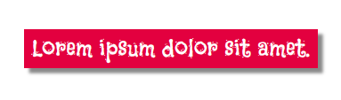

Je kunt de `shadow` CSS class gebruiken om een slagschaduweffect toe te voegen aan HTML elementen, zoals `<section>`, `
`, ``, en `<blockquote>`.

Dit voorbeeld voegt een schaduweffect toe aan een `<blockquote>` element.

## --- code ---

language: html
filename: index.html
line_numbers: false
--------------------------------------------------------

<main class="page">
  <section class="wrap">
    <blockquote class="secondary shadow">
Lorem ipsum dolor sit amet.
</blockquote>
  </section>
</main>

\--- /code ---

Je kunt de eigenschappen van de `shadow` class in `style.css` aanpassen om verschillende schaduw effecten te creëren.

## --- code ---

language: css
filename: style.css
line_numbers: false
--------------------------------------------------------

.shadow {
box-shadow: 5px 5px 3px 0px #888888; /\* grootte van schaduw rechts en onder, vervaging, spreiding en kleur \*/
/_box-shadow: 5px 5px 4px 2px var(--detail);_/
}

\--- /code ---

**Tip:** Probeer kleur toe te voegen aan je schaduwen. Gebruik je detailkleuren `var(--detail)` of `var(--detail2)` om gekleurde schaduweffecten te creëren.

